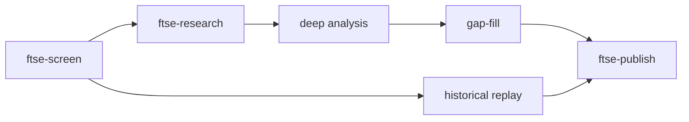

# Architecture & data model

How the FTSE Value Investor pipeline fits together: stages, canonical stores, and
published projections. For north-star stages and exit criteria see
[`PROJECT_OBJECTIVE.md`](PROJECT_OBJECTIVE.md).

---

## Live pipeline

Sunday CI (and manual runs) follow one spine. Offline library work (`ftse-library`)
uses the same research agent stack but **does not** touch the live FTSE 350 screen.



| Stage | CLI | Core module | Primary artifacts |
|-------|-----|-------------|-------------------|
| Screen | `ftse-screen` | `src/value_investor/pipeline.py` | `output/latest_signals.csv`, `output/history/run_*.json.gz` |
| Research | `ftse-research` | `src/value_investor/research/runner.py` | `output/research/{TICKER}/` |
| Deep analysis | `ftse-email --deep-analysis` | `src/value_investor/deep_analysis.py` | `output/deep_analysis.txt` |
| Gap-fill | `ftse-research --gap-fill` or `ftse-email --research-gap-fill` | `src/value_investor/research/gap_fill.py` | `output/gap_fill_summary.json` |
| Publish | `ftse-publish` | `src/value_investor/publish.py` | `docs/data/latest.json`, `docs/research/*.md` |
| Historical | auto in screen; also `ftse-historical` | `src/value_investor/historical_analysis.py` | `output/historical_analysis_summary.json` |

Typical production wrapper:

```bash
ftse-email --dry-run --publish-dashboard --deep-analysis --research-docs --research-gap-fill
```

---

## Canonical vs published data

| Layer | Location | Role |
|-------|----------|------|
| **Workspace** | `output/` | Mutable run artifacts; gitignored locally |
| **Published dashboard** | `docs/data/` | Static site payload (`latest.json`, charts, config) |
| **Published memos** | `docs/research/*.md` | Human-readable memo copies for the dashboard |
| **Offline library** | `docs/data/library/` | Stage-3 multi-market snapshots; no live screen impact |

Rule: **write canonical data once under `output/`**, then **project** a subset at publish time.
Do not treat `docs/data/latest.json` as the source of truth for memos or signals.

---

## Research store layout

Each memo ticker owns a directory under `output/research/{TICKER}/`:

```
output/research/{TICKER}/
├── research.json          # canonical ResearchDocument
├── research.md            # rendered markdown
├── agent_id.txt
├── timeline.json          # revision index (append-only)
├── revisions/{id}.json.gz # point-in-time snapshots
└── sources/
    ├── financials_annual.json
    ├── news_manifest.json
    ├── news_batch_*.json
    ├── screening_snapshot.json
    ├── gap_fill_source_map.json
    └── filings/           # index + bodies/*.txt
```

### `ResearchDocument` (`research/document.py`)

| Field group | Examples | Notes |
|-------------|----------|-------|
| Identity | `ticker`, `name`, `signal`, `version`, `mode` | `mode`: `initial` \| `weekly_update` \| `gap_fill` |
| Memo sections | `executive_summary`, `investment_thesis`, … | Agent-authored prose |
| Verdict overlay | `research_verdict`, `research_confidence`, `research_rationale` | Feeds screen overlay + paper track |
| Provenance | `weekly_updates`, `source_counts`, `memo_quality` | `memo_quality` is **derived** at save time |
| Paths | `research_path`, `agent_id` | Set by `ResearchStore.save()` |

### `memo_quality` (`research/source_quality.py`)

Computed by `attach_memo_quality()` on every research save (initial, weekly, gap-fill).
Not authoritative for trading — observability and learning feedback only.

| Component | Weight | Source |
|-----------|--------|--------|
| Filing bodies | 35% | `source_counts.filings_with_body` / `filings_total` |
| Financial depth | 20% | `source_counts.financial_years` |
| News coverage | 15% | `source_counts.news_articles` |
| Evidence ladder | 20% | `inspect_local_sources()` thin gaps |
| Gap resolution | 10% | gap-fill `question_outcomes` statuses |

Grades: `strong` (≥0.75), `adequate`, `thin`, `poor`.

Backfill without re-running agents: `python3 scripts/backfill_memo_quality.py`.

### Point-in-time revisions (`research/timeline.py`)

Every `ResearchStore.save()` appends an immutable revision:

- `timeline.json` — index of `{ revision_id, as_of, run_at, mode }`
- `revisions/{revision_id}.json.gz` — full document + `sources_as_of` + optional `delta`

`get_research_as_of(output_dir, ticker, as_of)` powers historical replay and the
research overlay **without lookahead**. Legacy memos without a timeline fall back to
`research.json` if `updated_at ≤ as_of`.

---

## Gap-fill loop

Red-flag names from deep analysis enter a bounded ask → fetch → agent loop. See
[`ops/gap-fill-fetch.md`](ops/gap-fill-fetch.md) for ingest details.

```
deep_analysis.red_flags
  → extract_gap_fill_targets()
  → ingest_research_sources(deepen_history=True)
  → prepare_gap_fill_source_pack()     # evidence ladder + planned alternates
  → run_gap_fill_research_agent()
  → [retry up to 3 attempts]
       → execute_planned_alternate_sources()  # CH / Investegate / SEC / IR
       → run_gap_fill_research_agent(follow_up=True)
  → attach_memo_quality()
  → ResearchStore.save()
```

Run summary: `output/gap_fill_summary.json` (`GapFillSummary`).

Model improvement suggestions (canonical): `docs/data/research_model_suggestions.json`
(mirrored to `output/` for email consumers).

---

## Dashboard bundle (`docs/data/latest.json`)

Assembled by `build_dashboard_bundle()` in `publish.py`:

| Key | Source |
|-----|--------|
| `reports` | `output/email_reports.json` or rebuilt from CSVs |
| `research` | index built from `output/research/*/research.json` at publish time |
| `deep_analysis`, `gap_fill` | parsed `output/` summaries |
| `historical_analysis`, `backtest`, `simulation` | `output/*.json` |
| `paper_automation`, `automation` | ladder + weekday paper status |

`research[]` index entry: `ticker`, `name`, `version`, `updated_at`, truncated
`executive_summary`, verdict fields, `source_counts`, `memo_quality`, `memo_path`.

---

## Historical replay

`historical_analysis.py` walks archived `output/history/run_*.json.gz` snapshots.
For each ticker × horizon it records:

- Screen signal vs research-adjusted signal (`get_research_as_of` + `compute_adjusted_signal`)
- `source_quality_score` and `research_confidence` from the point-in-time memo
- Forward excess return vs ^FTSE

Needs **≥2 archived weekly runs** within the analysis window before strategy
results populate.

---

## Offline library (stage 3)

`ftse-library` grows `docs/data/library/markets/{market_id}/` independently:

- Layer A: fundamentals + PIT constituent snapshots
- Layer B: screen-lite (offline signals, `signal_history.csv`)
- Layer C: selective research memos under `.../screen/research/`

Same agent code paths as live FTSE research; **separate storage tree**. The live
screener stays on FTSE 350 until stage 4.

---

## Known dual-write paths (intentional)

| Artifact | Canonical | Mirror / projection |
|----------|-----------|---------------------|
| Research memo | `output/research/{TICKER}/research.json` | `docs/research/{slug}.md` + `latest.json` index |
| Model suggestions | `docs/data/research_model_suggestions.json` | `output/research_model_suggestions.json` |
| Run summary | per-ticker `research.json` | `output/research_summary.json` (convenience) |

When adding new fields, extend `ResearchDocument` and the publish index — avoid
a third parallel store.

---

## Related docs

- [`PROJECT_OBJECTIVE.md`](PROJECT_OBJECTIVE.md) — stages and exit criteria
- [`ops/gap-fill-fetch.md`](ops/gap-fill-fetch.md) — gap-fill ingest and retry behaviour
- [`ops/primary-learning-track.md`](ops/primary-learning-track.md) — paper book vs market
