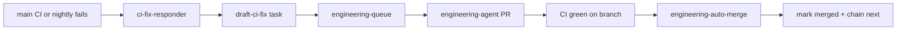

# CI failure → engineering agent → scoped auto-merge

When **main** CI fails on pytest, the repo can draft a narrowly scoped engineering
task, dispatch the supervised agent, and **auto-merge** the PR when CI and the
path guard are both green.

## Flow



## When a task is drafted

`ci-fix-responder.yml` runs after the **CI** or **CI Main Nightly** workflow completes
with `failure` on **main** for:

- `push` (code merges)
- `schedule` (daily full pytest — see `ci-main-nightly.yml`)
- `workflow_dispatch` (manual / cron-job.org)

It does **not** draft tasks for pull-request CI failures (avoids queue spam).

1. Parses `gh run view --log-failed` for `FAILED tests/...` lines
2. Calls `ftse-engineering draft-ci-fix`
3. Commits `docs/data/engineering_tasks.json` when a new task is created
4. Dispatches `engineering-queue.yml`

## Task shape

| Field | Value |
|-------|--------|
| `area` | `ci` |
| `source` | `ci_failure` |
| `priority_score` | `95.0` (jumps ahead of routine ingest/scoring) |
| `allowed_paths` | Failing test file(s), inferred `src/` modules, `tests/conftest.py`, `.github/workflows/ci.yml` when relevant |
| `auto_merge` | `true` only when scope is narrow and touches no `blocked_paths` |

Deduping: skips when an open task with the same title or another open `ci_failure`
task already exists.

## Auto-merge eligibility

A task is eligible when **all** of:

- `auto_merge: true` on the task JSON
- Status is `pr_open`
- Branch matches `cursor/eng-YYYYMMDD-NN-1de3`
- PR checks are green (`gh pr checks`)
- Changed files ⊆ `allowed_paths` and ∩ `blocked_paths` = ∅ (`ftse-engineering check-pr-paths`)

`engineering-auto-merge.yml` listens for **CI success** on engineering branches and
runs `ftse-engineering try-auto-merge`. Fork PRs are ignored (`head_repository` must
equal this repo). The branch name is passed via `env` and must match
`cursor/eng-YYYYMMDD-NN-1de3` exactly.

Non-eligible tasks (broad scope, blocked paths, ingest/scoring work) stay as
**draft PRs** for human merge — same as before.

## CLI

```bash
# Draft from a failed run (local / Actions)
ftse-engineering draft-ci-fix --run-id 30757414833

# Check whether a task may auto-merge
ftse-engineering task-auto-merge --task-id eng-20260802-01

# Merge when eligible (used by workflow)
ftse-engineering try-auto-merge --branch cursor/eng-20260802-01-1de3
```

## Guardrails

- Does **not** auto-merge ingest/scoring/prompt tasks unless explicitly flagged
- Does **not** edit `blocked_paths` (paper fund, simulator, `policy.json`, etc.)
- `engineering-path-guard` CI job still runs on every engineering PR
- Main-branch failures only (push, schedule, workflow_dispatch) — not PR CI

## PR CI monitoring (`cursor/*` pull requests)

When **CI fails on a `cursor/*` pull request**, `ci-pr-autofix.yml` runs after the
failed CI workflow:

1. Classifies failure kinds from failed job logs (ruff, pytest, path guard, data JSON)
2. Attempts **scoped ruff** autofix when applicable
3. On **`cursor/eng-*` engineering branches**, attempts **path-guard allowlist expand**
   when `engineering-path-guard` fails (adds missing `allowed_paths` on the task in
   `docs/data/engineering_tasks.json`, then re-validates)
4. Verifies with scoped ruff + path guard (engineering branches) + full pytest
5. Commits with `chore(ci): …` and pushes when a fix was applied
6. **Always posts a PR comment** with diagnosis (failure kinds, violations, pytest
   nodes, hints) — even when no automatic fix was possible

**Guardrails:**

- Only **same-repo** `cursor/*` PR branches (`head_repository.full_name == github.repository`)
- Branch names must match `^cursor/[A-Za-z0-9][A-Za-z0-9._/-]*$` (no shell metacharacters)
- Package + autofix scripts installed from **main** (trusted); PR head is checked out afterward
- Skips when the latest commit already starts with `chore(ci):` (one bot attempt per push)
- Pytest and committed-data JSON failures are **diagnosed but not auto-fixed** on PRs
- Path-guard expand only adds non-blocked paths; blocked paths still need agent/human edits
- See [gha-secret-hygiene.md](gha-secret-hygiene.md) for why these gates matter on a public repo

**Local dry-run:**

```bash
gh run view <run-id> --log-failed > /tmp/ci_failed.log
python3 scripts/ci_pr_autofix.py \
  --base origin/main \
  --head HEAD \
  --branch cursor/eng-20260812-03-1de3 \
  --log-file /tmp/ci_failed.log \
  --json
```

## PR ruff autofix (legacy section — see PR CI monitoring above)

When **CI fails on a `cursor/*` pull request** due to scoped **ruff** (format or check),
`ci-pr-autofix.yml` runs after the failed CI workflow:

1. Fetches failed job logs (`gh run view --log-failed`)
2. Runs `scripts/ci_pr_autofix.py` — applies `ruff check --fix` + `ruff format` on changed
   `src/` / `tests/` files only
3. Re-runs scoped ruff + full `pytest` locally in the workflow
4. Commits `chore(ci): autofix ruff on changed Python files` and pushes to the PR branch
5. Posts a **PR comment** with links to the failed run and fix commit (so red CI is not mistaken for an unresolved failure)
6. CI re-runs on the new commit

**Guardrails:**

- Only `cursor/*` PR branches (matches cloud-agent branch naming)
- Skips if the latest commit already starts with `chore(ci): autofix` (one attempt per failure cycle)
- Does **not** autofix pytest or `check_committed_data_json` failures — those still use
  main-branch `ci-fix-responder` or manual fixes
- Does not run on main push failures (existing `ci-fix-responder` behaviour)

**Local dry-run:**

```bash
gh run view <run-id> --log-failed > /tmp/ci_failed.log
python3 scripts/ci_pr_autofix.py --base origin/main --head HEAD --log-file /tmp/ci_failed.log --json
```

## Scoped Python lint (ruff)

CI and nightly run **ruff check + ruff format --check** only on **changed** `src/` and
`tests/` Python files in the diff — not the whole tree. Legacy style debt does not block
merges until a module is touched.

```bash
# Same check CI runs on a branch
python3 scripts/check_changed_python.py --base origin/main --head HEAD
```

Engineering agent prompt asks for `ruff check --fix` and `ruff format` on edited Python
files. `ci` tasks may edit `pyproject.toml` ruff config and the check script itself.

### Local pre-commit (optional)

After `pip install -e ".[dev]"`, install hooks once:

```bash
pre-commit install
```

Hooks run `ruff check --fix` and `ruff format` on staged Python files before each
commit. CI still scopes ruff to the PR diff — pre-commit is an early warning, not a
substitute.

### Full-tree ruff (one-off / periodic)

```bash
ruff check --fix src/ tests/ scripts/
ruff format src/ tests/ scripts/
```

The repo was bulk-formatted once (Aug 2026) so touched files rarely surface legacy lint.

## Nightly full CI on main

`docs/data/**` commits and `[skip ci]` automation pushes intentionally skip push CI
(see `.github/workflows/ci.yml` `paths-ignore`). That can hide test coupling to
committed snapshots until a code PR runs pytest.

**`ci-main-nightly.yml`** runs full pytest on `main` daily (07:30 UTC via
cron-job.org; GitHub `schedule` backup). Failures enter the same ci-fix-responder
loop above.

Register the cron job:

```bash
WORKFLOW_DISPATCH_PAT=… CRONJOB_API_KEY=… ./scripts/import_cron_jobs.py --job ci-main-nightly
```

## Related

- [ops-monitor.md](ops-monitor.md) — daily ops drafting for workflow overdue
- [github-actions-flakes.md](github-actions-flakes.md) — CI triage
- `scripts/check_committed_data_json.py` — pre-pytest JSON integrity guard
