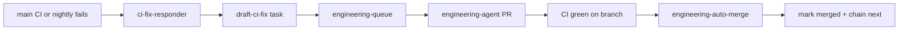

# CI failure → engineering agent → scoped auto-merge

When **main** CI fails on pytest, the repo can draft a narrowly scoped engineering
task, dispatch the supervised agent, and **auto-merge** the PR when CI and the
path guard are both green.

## Flow



## When a task is drafted

`ci-fix-responder.yml` runs after the **CI** or **CI Main Nightly** workflow completes
with `failure` on **main** for:

- `push` (code merges)
- `schedule` (daily full pytest — see `ci-main-nightly.yml`)
- `workflow_dispatch` (manual / cron-job.org)

It does **not** draft tasks for pull-request CI failures (avoids queue spam).

1. Parses `gh run view --log-failed` for `FAILED tests/...` lines
2. Calls `ftse-engineering draft-ci-fix`
3. Commits `docs/data/engineering_tasks.json` when a new task is created
4. Dispatches `engineering-queue.yml`

## Task shape

| Field | Value |
|-------|--------|
| `area` | `ci` |
| `source` | `ci_failure` |
| `priority_score` | `95.0` (jumps ahead of routine ingest/scoring) |
| `allowed_paths` | Failing test file(s), inferred `src/` modules, `tests/conftest.py`, `.github/workflows/ci.yml` when relevant |
| `auto_merge` | `true` only when scope is narrow and touches no `blocked_paths` |

Deduping: skips when an open task with the same title or another open `ci_failure`
task already exists.

## Auto-merge eligibility

A task is eligible when **all** of:

- `auto_merge: true` on the task JSON
- Status is `pr_open`
- Branch matches `cursor/eng-YYYYMMDD-NN-1de3`
- PR checks are green (`gh pr checks`)
- Changed files ⊆ `allowed_paths` and ∩ `blocked_paths` = ∅ (`ftse-engineering check-pr-paths`)

`engineering-auto-merge.yml` listens for **CI success** on engineering branches and
runs `ftse-engineering try-auto-merge`.

Non-eligible tasks (broad scope, blocked paths, ingest/scoring work) stay as
**draft PRs** for human merge — same as before.

## CLI

```bash
# Draft from a failed run (local / Actions)
ftse-engineering draft-ci-fix --run-id 30757414833

# Check whether a task may auto-merge
ftse-engineering task-auto-merge --task-id eng-20260802-01

# Merge when eligible (used by workflow)
ftse-engineering try-auto-merge --branch cursor/eng-20260802-01-1de3
```

## Guardrails

- Does **not** auto-merge ingest/scoring/prompt tasks unless explicitly flagged
- Does **not** edit `blocked_paths` (paper fund, simulator, `policy.json`, etc.)
- `engineering-path-guard` CI job still runs on every engineering PR
- Main-branch failures only (push, schedule, workflow_dispatch) — not PR CI

## Scoped Python lint (ruff)

CI and nightly run **ruff check + ruff format --check** only on **changed** `src/` and
`tests/` Python files in the diff — not the whole tree. Legacy style debt does not block
merges until a module is touched.

```bash
# Same check CI runs on a branch
python3 scripts/check_changed_python.py --base origin/main --head HEAD
```

Engineering agent prompt asks for `ruff check --fix` and `ruff format` on edited Python
files. `ci` tasks may edit `pyproject.toml` ruff config and the check script itself.

## Nightly full CI on main

`docs/data/**` commits and `[skip ci]` automation pushes intentionally skip push CI
(see `.github/workflows/ci.yml` `paths-ignore`). That can hide test coupling to
committed snapshots until a code PR runs pytest.

**`ci-main-nightly.yml`** runs full pytest on `main` daily (07:30 UTC via
cron-job.org; GitHub `schedule` backup). Failures enter the same ci-fix-responder
loop above.

Register the cron job:

```bash
WORKFLOW_DISPATCH_PAT=… CRONJOB_API_KEY=… ./scripts/import_cron_jobs.py --job ci-main-nightly
```

## Related

- [ops-monitor.md](ops-monitor.md) — daily ops drafting for workflow overdue
- [github-actions-flakes.md](github-actions-flakes.md) — CI triage
- `scripts/check_committed_data_json.py` — pre-pytest JSON integrity guard
