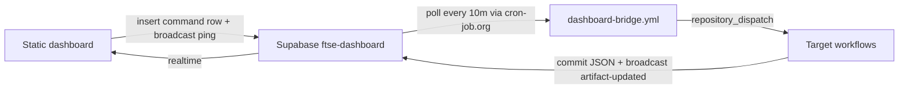

# Dashboard bridge — static Pages ↔ git Actions

GitHub Pages cannot run Python or hold repo secrets. This bridge uses a **single Supabase project** as the control plane for all dashboard buttons that need to trigger git-side work.

## Architecture



| Piece | Role |
|-------|------|
| `docs/data/dashboard_config.json` | Public anon URL/key + channel name (`enabled: true` when live) |
| `docs/dashboard_bridge.js` | Browser client — insert command, subscribe, listen for artifact updates |
| `dashboard_commands` table | Durable queue of page → git requests |
| Realtime channel `ftse-dashboard` | Fast ping (`command`) + completion notify (`artifact-updated`) |
| `ftse-dashboard-bridge process-pending` | Worker — polls table, dispatches GitHub `repository_dispatch` |
| Target workflows | `progress-report.yml`, `engineering-queue.yml`, `ops-monitor.yml`, `dashboard-bridge.yml` (`refresh-queue-ui`), `lifecycle-experiment-ack.yml`, `lifecycle-experiment-start.yml`, `human-task-ack.yml` |

**Yes — one Supabase channel/table can cover all page→git actions.** Add new actions by extending `SUPPORTED_ACTIONS` in `dashboard_bridge.py` and wiring a workflow handler.

## Schedule (primary vs backup)

| Trigger | Role | Cadence |
|---------|------|---------|
| **cron-job.org** (`dashboard-bridge`) | **Primary** | Every day, every 10 minutes (`minutes` 0/10/20/30/40/50 UTC; `wdays` `[-1]`) |
| GitHub `schedule` `*/10 * * * *` | Backup only | Same cadence; Actions often drifts **hours** (observed 2–5h) |
| `workflow_dispatch` | On-demand drain | Actions → **Dashboard bridge worker** → Run workflow |

Register / re-import:

```bash
WORKFLOW_DISPATCH_PAT=… CRONJOB_API_KEY=… ./scripts/import_cron_jobs.py --job dashboard-bridge
```

`process-pending` is safe to double-fire (empty queue → no-op). Ops-monitor flags the workflow stale if no successful run within **1 hour** on any day (`MONITORED_WORKFLOWS.dashboard_bridge`).

The Acknowledge / Start UI waits up to ~12 minutes for the command row to leave `pending`. Use **Run workflow** to drain immediately when needed.

## Lifecycle Start / Acknowledge dedupe

Catalog **factor chips** (e.g. `add_cadence`, `entry_kind_tag`) are separate learning questions that can share one **experiment id** (`entry_dca_overlay`). Start and Acknowledge authorize by experiment, not factor.

Within one `process-pending` batch the bridge:

1. Dispatches the first `lifecycle-experiment-ack` / `lifecycle-experiment-start` per `action:experiment_id`.
2. Marks later same-experiment rows `done` with `Skipped duplicate … (same experiment)` — no second `repository_dispatch`.

Without Start dedupe, two pending Starts for the same overlay would both dispatch; the second `lifecycle-experiment-start` run fails with “already started for this finding”.

Ack and Start remain independent actions (both may dispatch for the same experiment).

## Supabase setup

### 1. Table

```sql
create table public.dashboard_commands (
  id uuid primary key default gen_random_uuid(),
  action text not null,
  payload jsonb not null default '{}'::jsonb,
  status text not null default 'pending'
    check (status in ('pending', 'processing', 'done', 'failed')),
  message text,
  github_run_url text,
  created_at timestamptz not null default now(),
  updated_at timestamptz not null default now()
);

alter table public.dashboard_commands enable row level security;

create policy "anon insert commands"
  on public.dashboard_commands for insert to anon
  with check (true);

create policy "anon read commands"
  on public.dashboard_commands for select to anon
  using (true);

-- Enable realtime
alter publication supabase_realtime add table public.dashboard_commands;
```

Tighten RLS in production (rate limits, signed tokens) if the project is public.

### 2. Realtime channel

Use broadcast channel name **`ftse-dashboard`** (matches `dashboard_config.json`).

### 3. GitHub secrets

| Secret | Purpose |
|--------|---------|
| `SUPABASE_URL` | Project URL |
| `SUPABASE_SERVICE_ROLE_KEY` | Worker poll + broadcast |
| `WORKFLOW_DISPATCH_PAT` | Dispatch `repository_dispatch` events |

### 4. Enable the dashboard

Edit `docs/data/dashboard_config.json`:

```json
{
  "schema_version": 1,
  "enabled": true,
  "supabase_url": "https://YOUR_PROJECT.supabase.co",
  "supabase_anon_key": "eyJ…",
  "commands_table": "dashboard_commands",
  "channel": "ftse-dashboard"
}
```

Commit and wait for Pages deploy. **Generate fresh report** then uses the bridge instead of a browser PAT.

## Supported commands

| Action | GitHub event | Workflow |
|--------|--------------|----------|
| `progress-report` | `progress-report` | `progress-report.yml` |
| `engineering-queue` | `engineering-queue` | `engineering-queue.yml` |
| `ops-monitor` | `ops-monitor` | `ops-monitor.yml` |
| `refresh-queue-ui` | `refresh-queue-ui` | `dashboard-bridge.yml` |
| `lifecycle-experiment-ack` | `lifecycle-experiment-ack` | `lifecycle-experiment-ack.yml` |
| `lifecycle-experiment-start` | `lifecycle-experiment-start` | `lifecycle-experiment-start.yml` |
| `human-task-ack` | `human-task-ack` | `human-task-ack.yml` |

## Queue health monitor

`docs/data/queue_health.json` is refreshed whenever:

- `ftse-engineering refresh-queue-ui` runs
- `ftse-ops-monitor run` completes
- `ftse-dashboard-bridge refresh-queue-health`

The Automation tab shows **merge lane** (auto-merge idle/running) and **agent/hunter lane** (dispatch idle/blocked/running) plus ops monitor dispatch signal.

## Local dev

```bash
ftse-dashboard-serve
# open http://127.0.0.1:8765/ — Generate uses POST /api/progress-report (no Supabase needed)
```

## Fallback

If Supabase is disabled, the progress report button falls back to a fine-grained PAT stored in browser localStorage (legacy). Prefer the bridge for shared devices.

See deferred **L240** — this bridge implements the recommended relay pattern.

## Related

- [`orchestrator-cron.md`](orchestrator-cron.md) — external cron policy
- [`position-lifecycle.md`](position-lifecycle.md) — Acknowledge / Start human gate
- [`progress-report.md`](progress-report.md) — report contents
- [`engineering-sync.md`](engineering-sync.md) — queue processor
- [`ops-monitor.md`](ops-monitor.md) — daily health checks (includes bridge freshness)
