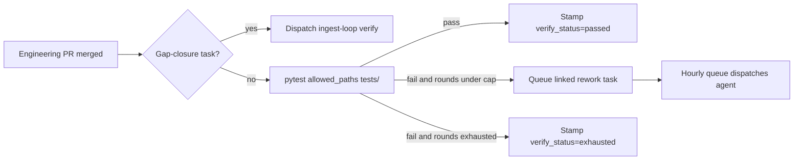
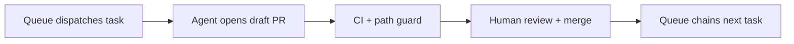

# Engineering queue synchronisation

Detects and repairs desync between the engineering queue processor and the
supervised engineering agent.

## Problem this solves

When `engineering-queue.yml` dispatches `engineering-agent.yml` with a concrete
`task_id`, the agent used to run `ftse-engineering compile` unconditionally.
Weekday compiles can mint fresh task ids from stale `output/` artifacts while
dropping still-open tasks from an older run stamp. The agent then failed with
*No open engineering tasks* even though the queue looked healthy.

## Protections

| Layer | Behaviour |
|-------|-----------|
| **Merge guard** | `_merge_task_rows` preserves all `open` tasks, not only terminal/`pr_open` rows |
| **Agent workflow** | Skips compile when `task_id` is provided; resolves stale ids via `resolve_dispatch_task_id` |
| **Queue recovery** | Hourly `recover-queue` marks tasks **merged** when GitHub shows a merged PR for their branch (before orphan `pr_open` reset) |
| **Ops monitor** | Daily `check_engineering_sync()`; reconciles queue and can dispatch `engineering-queue.yml` |
| **Dashboard UI** | `ftse-engineering refresh-queue-ui` on task status changes → `automation.json` + `latest.json` |

## CLI / module

```python
from value_investor.engineering_sync import (
    audit_compile_drop_risk,
    resolve_dispatch_task_id,
    run_engineering_sync,
)
```

`audit_compile_drop_risk()` returns open task ids that would disappear if compile
ran against present `output/post_run_review.md` artifacts.

`run_engineering_sync(apply=True)` runs safe queue recovery only — it never
rewrites task payloads or deletes tasks. Recovery order:

1. **Mark merged** — `pr_open` / wrongly-reset `open` tasks whose engineering PR merged on GitHub
2. **Reconcile orphans** — reset `pr_open` only when no open PR and no merged PR exists
3. Retry failed tasks / park CI-blocked `pr_open`

## Auto-restart policy

Redispatch happens when **all** of:

1. Open engineering tasks remain
2. No engineering PR is in flight
3. Recent `engineering-agent` failures (6h) **or** compile would drop open tasks

Dispatch target is always re-resolved to a currently open task id.

## Related

- [`ops-monitor.md`](ops-monitor.md) — daily health checks
- [`ci-fix-automation.md`](ci-fix-automation.md) — scoped CI auto-merge loop

## Post-merge acceptance verify + capped rework (L161)

After an engineering PR merges, the queue runs a **task-scoped acceptance pytest**
gate (`ftse-engineering verify-merged`) unless the task is an ingest gap-closure
fix (those keep the existing outcome-based ingest-loop verification chain).



Rules:

- Only runs when the merged task lists `tests/…` under `allowed_paths`.
- Rework is a **new open task** (new id/branch) linked via
  `evidence.verify_chain_root_id` / `parent_task_id` — avoids colliding with the
  merged branch reconcile path.
- Hard cap: **3** engineering attempts in the verify chain
  (`MAX_VERIFY_REWORK_ROUNDS`).
- Does **not** auto-merge rework; same draft-PR / human-merge policy as the parent
  unless the parent was already `auto_merge: true` (CI-fix).

Manual:

```bash
ftse-engineering --json verify-merged --task-id eng-YYYYMMDD-NN
ftse-engineering --json verify-merged --task-id eng-YYYYMMDD-NN --dry-run
```

## Library ladder → engineering draft

When the offline ladder cannot run screen-lite on the focus market (usable metrics
rows below `min_metrics_for_screen`, or screen-lite raises), `run_library_ladder`
calls `draft_library_ladder_engineering_tasks` and appends a **coverage** task with
provider/library `allowed_paths` (deduped per market if an open task already exists).

`library-grow.yml` commits `docs/data/engineering_tasks.json` and dispatches
`engineering-queue.yml` when a new task is drafted — same pattern as ingest-loop
micro-compile.

Manual replay:

```bash
ftse-engineering draft-library-ladder --library-root docs/data/library --json
```

## Engineering PR CI + email

GitHub often blocks CI on PRs opened by `GITHUB_TOKEN` until a human approves the
workflow run (`action_required`, 0 jobs). Two layers address this:

| Layer | Mechanism |
|-------|-----------|
| **Primary** | `engineering-agent.yml` uses `WORKFLOW_DISPATCH_PAT` for `git push` + `gh pr create` so CI starts without approval |
| **Backup** | SMTP email via `ftse-engineering notify-pr-open` when a PR opens (includes CI approval hint when PAT was not used) |

### PAT setup (one-time)

Add repository secret **`WORKFLOW_DISPATCH_PAT`** — fine-grained PAT with:

- **Contents:** Read and write
- **Pull requests:** Read and write
- **Actions:** Read and write (for existing dispatch scripts)

When `WORKFLOW_DISPATCH_PAT` is not set, the workflow falls back to
`GITHUB_TOKEN` and logs a warning.

Email reuses Sunday report SMTP secrets (`SMTP_*`, `EMAIL_TO`).

## Merge policy

Not every engineering task needs a human merge — but **most do by design**.

### Supervised loop (default)



Post-run review tasks (ingest, scoring, research, routine ops) are compiled with
`auto_merge: false` and open as **draft PRs**. You review the diff and merge when
satisfied.

`WORKFLOW_DISPATCH_PAT` removes the GitHub **CI approval gate** on bot PRs; it does
**not** remove this merge step.

### When auto-merge applies

| Condition | Human merge? |
|-----------|----------------|
| Post-run ingest / scoring / research | **Yes** (draft PR) |
| Routine ops / engineering hardening | **Yes** (draft PR) |
| Narrow CI-fix task (`auto_merge: true`) | **No** — merges when CI + path guard pass |
| Any change touching `blocked_paths` | **Yes** — never auto-merged |

CI-fix tasks are drafted by `ci-fix-responder.yml` when **main** pytest fails. A
task gets `auto_merge: true` only when scope is narrow (≤ 8 `allowed_paths`, all
within safe prefixes, no blocked paths). `engineering-auto-merge.yml` squash-merges
eligible PRs after green CI.

See [`ci-fix-automation.md`](ci-fix-automation.md) for the full eligibility rules
and CLI (`ftse-engineering task-auto-merge`, `try-auto-merge`).

### Notifications

`notify-pr-open` emails on every new engineering PR. The message notes whether the
task is auto-merge eligible so you can ignore merge for narrow CI fixes but still
review everything else.

`notify-queue-blocked` (L96) emails when the queue processor stops dispatching due
to spend checkpoint, agent failures, orphan `pr_open` reconcile, or newly parked
tasks. Wired from `engineering-queue.yml` after recovery + sync + gate evaluation.
