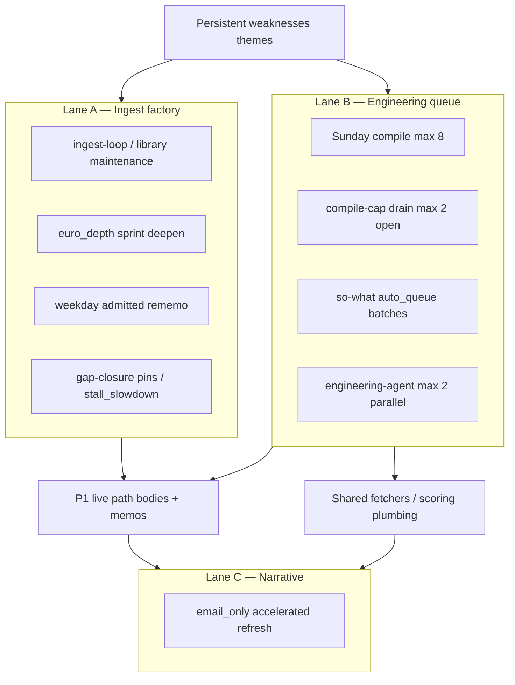

# Post-run improvement review & intensive clearance policy

Canonical policy for interpreting the **Post-run improvement review** (Analysis tab),
clearing **Persistent weaknesses** without mistaking them for an engineering backlog,
and running **intensive clearance** in parallel with the main engineering queue using
existing automation (ingest factory, clash-aware agents, batching).

**Audience:** Cloud agents, engineering queue, ops monitor, humans triaging Analysis.

**Spend alignment:** P1 live-path utilization (FTSE buy-tier filings, FCF basis, overlay
bind, memo recency) first; P2 offline ingest cascade (focus market sprint) second.
Everything in this doc is scoped to those priorities unless explicitly deferred.

## Related runbooks

| Doc | Role |
|-----|------|
| [accelerated-review-cycle.md](accelerated-review-cycle.md) | Refresh Analysis narrative after merges (`email_only`) |
| [engineering-sync.md](engineering-sync.md) | Parallel dispatch, compile cap, idle backstop, narrow scope |
| [so-what-gap-closure.md](so-what-gap-closure.md) | Batched FCF/enforcement gaps (`source=so_what_closure`) |
| [library-ingest-escalation.md](library-ingest-escalation.md) | Stall, gap-closure pins, compile-cap drain vs hunter |
| [euro-depth-sprint.md](euro-depth-sprint.md) | Focus ingest sprint, `stall_slowdown` intensive dispatch |
| [ops-monitor.md](ops-monitor.md) | Daily heal + so-what `--apply` + queue redispatch |
| [progress-report.md](progress-report.md) | Role coherence, compile-cap audit signals |
| [project-traffic.md](project-traffic.md) | Pause/resume when ≥2 stuck PRs; narrow auto-merge |
| [analysis-review.md](analysis-review.md) | Sunday modelling review (separate from post-run plan) |
| [market-sharded-learning.md](market-sharded-learning.md) | P2 focus market; do not spray 21-market rememo |

---

## 1. Artifacts (what “post-run” is)

| Artifact | Path | Producer |
|----------|------|----------|
| Published bundle | `docs/data/latest.json` → `post_run_review` | `ftse-publish` after Sunday email |
| Run output (compile input) | `output/post_run_review.md` | `email-report` `--post-run-review` |
| Suggestion store | `docs/data/research/research_model_suggestions.json` (rollup in agent payload) | Gap-fill / memos over time |
| Engineering queue | `docs/data/engineering_tasks.json` | `ftse-engineering compile`, so-what, system_gaps compile, ops micro-compile |
| So-what snapshot | `docs/data/so_what_closure.json` | `ftse-progress-report so-what --apply` |
| Last ladder dedupe | `docs/data/library/last_ladder.json` → `layers.selective_research.dedupe` | `ftse-library ladder` |
| System gaps | `docs/data/system_gaps.json` | `ftse-analysis-review system-gaps --write` |

The post-run agent reads structured JSON (screen, buy-tier filing coverage, memo
snapshots, deep-analysis excerpts, gap-fill, **suggestions backlog + recent**,
`system_gaps`, `so_what_closure`) and writes five sections:

1. **EXECUTIVE SUMMARY**
2. **PERSISTENT WEAKNESSES**
3. **THIS WEEK'S FINDINGS**
4. **PRIORITISED IMPROVEMENT PLAN** (top 5)
5. **DEFER**

Implementation: `src/value_investor/post_run_review.py` (`_build_post_run_prompt`).

---

## 2. Core rule: Persistent weaknesses ≠ engineering backlog

**Persistent weaknesses** is a **theme rollup** across accumulated
`research_model_suggestions` (often hundreds of rows: ingest, scoring, prompt,
orchestration). The agent **clusters duplicates** and cites frequencies when the
JSON supports it.

| Signal | Meaning |
|--------|---------|
| “173 ingest of 535 total” | Suggestion **history**, not 173 open tasks |
| Long bullet list (RNS, CH, IR, FCF, …) | Recurring **categories**, not a sprint charter |
| **PRIORITISED IMPROVEMENT PLAN** (5 lines) | Sunday agent’s **recommended** eng themes — may already be **merged** |
| `so_what_closure` empty / no new `auto_queue` | No batched enforcement tasks minted **this** run |
| `engineering_tasks.json` `open_count=0` | Queue idle — **do not** re-open merged work by re-reading weaknesses |

**Misread (forbidden):** “Clear every persistent weakness this week.”  
**Correct read:** “Route themes through **lanes A/B/C** (below); measure progress by
buy-tier filing bodies, FCF wiring on live screen, and **backlog growth rate**, not
by shortening prose alone.”

When plan lines have **no open engineering match** but **fuzzy-match merged tasks**,
run **Lane C** (`email_only`) — see [§7](#7-lane-c--narrative-refresh). Idle compile
backstop **will not** reopen merged titles (`ftse-engineering try-idle-compile-backstop`).

---

## 3. Three-lane intensive clearance model

Intensive clearance is **not** a fourth queue. It is how existing automation combines.



### Lane A — Ingest factory (parallel, autonomous)

**Clears:** Per-ticker filing bodies, indexed-without-body, thin buy-tier depth,
zero-body catch-up for rememo (after bodies land).

**Mechanisms:**

- Weekday **ingest-loop** and library **maintenance/sprint** (`max_targets`, deepen).
- **Euro_depth sprint** policy ([euro-depth-sprint.md](euro-depth-sprint.md)).
- **Weekday rememo:** `ftse-library rememo` / `ftse-research --weekday-rememo` when
  bodies improve (cap 3, `weekly_ops` headroom).
- **Stall / slowdown:** auto-dispatch **pinned intensive gap-closure**
  (`gap_closure_trigger=stall_slowdown`) — single-ticker depth, not 173 eng tasks.
- **Human-only pins:** ingest deviations approve → `library_ingest_pins.json` ([ingest-deviations.md](ingest-deviations.md)).

**Does not require** an engineering PR for each ticker. This lane should run **while**
Lane B is busy.

**P1 focus:** FTSE buy-tier and names blocking conviction in deep analysis (bodies +
structured IR metrics). **P2:** focus market buy-tier per sprint policy.

**Explicitly out of Lane A (unless promoted):** Off-buy-tier memos with zero filing
index (e.g. legacy hold names) — see deferred **N138**; revisit only when buy-tier
sprint is exhausted and focus-book parity is still a goal.

### Lane B — Engineering queue (shared code, bounded parallel)

**Clears:** One fix → many tickers (Investegate fetch path, CH OCR gates, dual FCF in
`summary.py`, index `with_body` parity checks, etc.).

**Mechanisms:**

| Mechanism | When | Batching |
|-----------|------|----------|
| Sunday `ftse-engineering compile` | After email / post-run | **max_tasks=8**; post-run plan first; dedupe merged/parked titles (14d lookback) |
| `ftse-engineering try-compile-cap-drain --apply` | Priority queue **idle**; role-coherence backlog | Up to **2 open** `compile_cap_drain`; coalesce near-dups; **before** parked hunter |
| `ftse-progress-report so-what --apply` | Ops monitor (daily apply) | **One task per `(area, kind)`** — `source=so_what_closure` |
| `ftse-analysis-review compile-system-gaps` | Sunday | High flags → `ana-sgap-*`; narrow auto-promote persist/publish/apply only |
| Micro-compile on ingest stall | Ops monitor | Single ingest eng task when buy-tier ingest stalled |
| First-principle **narrow split** | Compile time | Compound titles → sibling tasks (`fcf` / `dividend` slices, tight `allowed_paths`) |

**Parallelism:** `max_parallel_engineering_agents` default **2**, **clash-aware**
([engineering-sync.md](engineering-sync.md)): non-overlapping `allowed_paths` may run
together; shared files (`engineering_tasks.json`, `policy.json`, same module paths)
block second dispatch.

**Auto-merge classes (when policy `merge`):** `ingest_narrow`, `scoring_narrow`,
`compile_cap_drain` — see [project-traffic.md](project-traffic.md#narrow-independent-verify-ingest--scoring--compile_cap_drain).

**Do not:** Create a separate “intensive clearance” queue or agent pool. Do not assign
one engineering task per ticker for scoring/FCF (use so-what batching + narrow ingest).

### Lane C — Narrative refresh

**Clears:** Stale **wording** on Analysis tab when code and ingest already moved.

**When:** Priority queue idle (`open_count=0`, `pr_open_count=0`), merged fixes on
`main`, `weekly_ops` headroom ~$15–25 for email agents.

**How:** [accelerated-review-cycle.md](accelerated-review-cycle.md) — orchestrator
`suite=email_only` (auto-chain max 2/week when eng PR merges + material change; or
manual procedure).

**Not a substitute** for Lane A/B. If persistent weaknesses still grow after Lane C,
the problem is **backlog or live path**, not missing LLM prose.

---

## 4. Theme → mechanism routing

Use this table when translating **Persistent weaknesses** bullets into work. Prefer
the **leftmost applicable** mechanism (factory before custom eng).

| Theme in post-run | Primary lane | Autonomous mechanism | P1/P2 |
|-------------------|-------------|----------------------|-------|
| RNS / Investegate bodies empty | A then B | Ingest deepen; eng **ingest_narrow** fetcher if systemic | P1 |
| CH PDF truncated / wrong entity | A + B | Gap-closure pin; CH pipeline / quarantine eng | P1 |
| IR PDF / `ir_presentation_metrics` empty | A + B | Allowlisted IR deepen; eng parser populate bridges | P1 |
| Yahoo quarterly / OCF gaps | B | Eng backfill + `CompanyMetrics`; may be merged already | P1 |
| Dual FCF / dividend coverage / conviction | B + so-what | Narrow **scoring** tasks; `so-what` batch enforcement | P1 |
| Wrong period tags / duplicate bodies | B | Orchestration / ingest selection eng (narrow) | P1 |
| `thin_memo_counted_as_coverage` (system_gaps) | A | **Ingest then body-lag rememo** — do **not** widen rememo_reason | P2 focus |
| `research_skipped_already_done` | A + B | Weekday rememo; ingest; not “force research” | P2 |
| `filing_ready_learning_stale` (sp500) | — | **Defer** in post-run DEFER; clock not FTSE buy-tier | P2 observe |
| Prompt / research suggestion noise | — | Defer until high-priority ingest/scoring **stops growing** | — |
| Schema / monitoring backlog | — | Defer per post-run DEFER section | — |

---

## 5. Same-category issues: how batching works

Multiple tickers or duplicate suggestions must **collapse** into shared work:

| Pattern | Batch shape | Where |
|---------|-------------|--------|
| Same enforcement gap (FCF overlay missing) | 1 eng task / `(area, kind)` + `evidence.tickers[]` | so-what |
| Same compound suggestion title | First-principle **siblings** (topic splits) | compile |
| Truncated compile candidates | Up to 2 **compile_cap_drain** tasks | idle drain |
| Same ingest stall | 1 micro-compiled ingest task | ops monitor |
| Same stubborn zero-body buy-tier | **Gap-closure chain** (e.g. 1/3 pins) | ingest escalation |
| Many tickers, same missing bodies | **Ingest loop batch** (not eng per ticker) | Lane A |

**Agents must not:** Open N parallel cloud sessions for N tickers when one batch task
or ingest pass is the designed path.

---

## 6. Parallel execution rules

| Work type | Parallel with engineering queue? | Limit |
|-----------|----------------------------------|-------|
| ingest-loop / sprint deepen | **Yes** | Runner capacity, rate limits (L323) |
| Weekday rememo | **Yes** | Cap 3/day/market; `weekly_ops` |
| engineering-agent | With itself | **2** non-clashing tasks |
| compile-cap drain + ingest | **Yes** | Drain only when priority queue idle |
| Sunday email + engineering compile | Sequential in bundle | Plan compiled after post-run written |
| Third concurrent engineering agent | **No** | Do not raise without policy change + defer |

**Traffic pause:** When ≥2 stuck `cursor/*` PRs, project-traffic **pauses dispatch**
— intensive clearance continues on Lane A only; do not force Lane B until clear
([project-traffic.md](project-traffic.md)).

---

## 7. Lane C — narrative refresh

**Symptoms that Lane C is needed:**

- Progress report INFO: post-run plan lines match **merged** tasks but Analysis text
  still lists them as open.
- `ftse-engineering try-idle-compile-backstop` → “would not add open tasks”.
- Human reads Persistent weaknesses and believes nothing shipped despite recent merges.

**Commands (after prerequisites in accelerated-review-cycle):**

```bash
ftse-engineering queue-status --json   # open_count=0, pr_open_count=0
# Dispatch orchestrator suite=email_only OR follow accelerated-review procedure
```

**Do not** use Lane C alone when `open_count>0` for P1 ingest/scoring unless those
tasks are intentionally in flight.

---

## 8. Cadence (automation map)

| Cadence | Automation | Lanes |
|---------|------------|-------|
| Weekday AM/PM | ingest-loop | A |
| Weekday | library-ingest-maintenance admitted rememo | A |
| Daily 07:45 / 13:15 UTC | ops-monitor (`so-what --apply`, micro-compile, queue dispatch) | A/B |
| Hourly | engineering-queue (clash-aware, max 2) | B |
| Sunday | email → post-run → compile (cap 8) → publish → **run-post-run-clearance** → dispatch eng queue | B (+ C signal) |
| Sunday (after analysis-review) | system-gaps compile → **run-post-run-clearance** (`analysis_review_follow_up`) | B |
| After eng merge (idle) | try-compile-cap-drain; optional email auto-chain | B + C |
| On demand | accelerated email_only | C |

---

## 9. Agent playbook (cloud / engineering)

When asked to “intensively clear persistent weaknesses” or similar:

1. **Read state (named files only):**
   - `docs/data/latest.json` → `post_run_review`, `so_what_closure`
   - `docs/data/engineering_tasks.json` → open / merged counts
   - `docs/data/system_gaps.json` if learning-path flags matter
   - `ftse-engineering queue-status --json`
   - `ftse-engineering compile-cap-audit` if queue idle

2. **Classify themes** using [§4](#4-theme--mechanism-routing) — P1 first.

3. **Execute lanes (do not skip A):**
   - Confirm ingest/rememo not starved (policy, cron flags in `automation.json`).
   - If queue idle: `try-compile-cap-drain --apply` when audit shows truncation.
   - Ensure ops path runs `so-what --apply` when FCF enforcement gaps exist.
   - Dispatch or implement **narrow** eng only for **shared plumbing** without
     duplicating merged titles.

4. **Never:**
   - Treat full suggestion count as sprint size.
   - Widen rememo for thin memos without new bodies (system_gaps + N138).
   - Fork a parallel “clearance” queue.
   - Promote sp500 learning clock ahead of FTSE FCF/bodies (post-run DEFER).

5. **After merges:** Lane C when queue idle; re-check persistent section on next
   published bundle.

6. **Park** new scope with `ftse-defer` when outside P1/P2 ([AGENTS.md](../../AGENTS.md)).

---

## 10. Human gates (minimal)

| Situation | Human action |
|-----------|--------------|
| Ingest deviation rows (IR exhausted, IWB) | Approve/dismiss per [ingest-deviations.md](ingest-deviations.md) |
| `analysis_tasks` / system_gaps produce flags | Promote judgment calls per [analysis-review.md](analysis-review.md) |
| Traffic paused | Fix or close stuck PRs; resume dispatch |
| FCF bridge wrong vs auto policy | Optional `fcf_bridge.json` override ([fcf-basis-bridges.md](fcf-basis-bridges.md)) |

No standing weekly “read every persistent weakness” checklist item — progress is
 judged by **live path metrics** and **queue/backlog dynamics**.

**Optional spot-check (human):** If **high-priority** suggestion count in post-run
text rises **two Sundays in a row** while FTSE buy-tier body median falls or flat,
escalate Lane A capacity or Lane B drain — not prompt churn.

---

## 11. CLI quick reference

```bash
# State
ftse-engineering queue-status --json
ftse-engineering compile-cap-audit
ftse-engineering try-idle-compile-backstop          # dry-run
ftse-progress-report so-what --dry-run

# Apply (automation usually owns these)
ftse-engineering run-post-run-clearance --apply --trigger post_run_review_email
ftse-engineering run-post-run-clearance --apply --trigger analysis_review_follow_up
ftse-engineering try-compile-cap-drain --apply
ftse-progress-report so-what --apply
ftse-engineering try-idle-compile-backstop --apply   # when plan truly new

# Log: docs/data/post_run_clearance.json (last_run.should_dispatch_engineering)

# Ingest / rememo (Lane A)
ftse-library rememo --json
# ingest-loop: workflow dispatch

# Narrative (Lane C)
# orchestrator suite=email_only — see accelerated-review-cycle.md
```

---

## 12. Success metrics (intensive clearance “done”)

Prefer **evidence** over shorter markdown:

| Metric | Source |
|--------|--------|
| FTSE buy-tier filing bodies (median, zero-body count) | `market_status` / filing health |
| Live screen FCF overlay / dual basis on top picks | `latest.json` reports, so-what closure |
| `rememo_eligible` → executed on focus/admitted | `last_ladder.json`, rememo summaries |
| High-priority suggestion **growth** week-on-week | post-run payload rollups |
| Open engineering tasks aligned to P1 | `engineering_tasks.json` |
| Persistent weaknesses **themes** stable or shrinking after Lane C | Analysis tab |
| **Learning data completeness** score ↑ (wiring, bodies, gap penalty) | `latest.json` → `learning_data_completeness` |

**Not sufficient alone:** Merged PR count without live-path verification; memo file
existence without body quality (`system_gaps` distrust counters).

---

## 13. Anti-patterns (explicitly forbidden)

1. **Backlog sprint:** “Implement all 535 suggestions.”
2. **Duplicate queue:** Intensive clearance team separate from engineering-queue.
3. **Per-ticker scoring PRs** for the same FCF enforcement gap.
4. **Rememo widening** for thin/zero-body without ingest (Phase B body-lag only).
5. **Re-compile post-run plan** verbatim when tasks merged — use Lane C + drain.
6. **Ignore Lane A** while only coding Lane B (bodies unblock more tickers than fetcher tweaks alone).
7. **sp500 / prompt / schema** intensive work while P1 FTSE FCF/bodies still regressing in deep analysis.

---

## 14. Prompt contract (post-run author)

The post-run agent must continue to:

- Cluster backlog themes; cite frequencies from JSON.
- Include `system_gaps` high flags in weaknesses with **green counter** callouts.
- Put **defer** items with revisit triggers in DEFER.
- Avoid duplicating `so_what_closure.auto_queue` work in the improvement plan
  (prompt rule in `_build_post_run_prompt`).

Policy authors: when changing post-run behavior, update this doc and
`post_run_review.py` prompt together.

---

## 15. Changelog

| Date | Change |
|------|--------|
| 2026-09-21 | Initial canonical policy (lanes A/B/C, batching, agent playbook) |
| 2026-09-21 | Auto `run-post-run-clearance` after email post-run + analysis-review follow-up |
