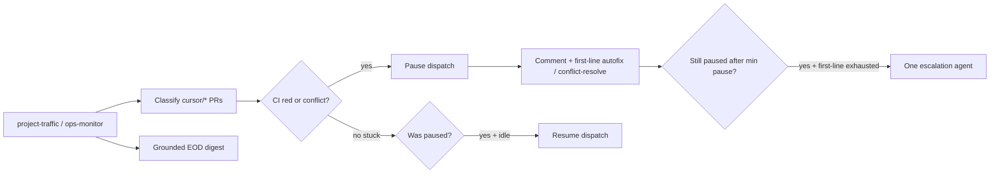

# Project traffic controller

Bounded project-management agent for the engineering PR queue: **pause** new PR
generation when monitored branches are stuck, **request fixes** (CI / merge
conflicts), **auto-resume** when clear, and emit a **grounded end-of-day digest**.

This is **not** general merge authority and **not** a full Phase B/C gate agent.
Merge stays human or scoped auto-merge ([`ci-fix-automation.md`](ci-fix-automation.md)).

## Why

Human triage of red / conflicted `cursor/*` PRs lags; meanwhile hourly
`engineering-queue` keeps opening more drafts and conflicts compound. A traffic
controller that can pause dispatch and send work back for fixes is the efficient
slice of a PM agent.

## Authority (v1)

| Action | Allowed? |
|--------|----------|
| Pause `engineering-agent` dispatch + parked-hunter-compile | Yes |
| Comment on stuck PRs requesting CI fix / conflict resolve | Yes |
| Dispatch scoped `engineering-conflict-resolve.yml` for `cursor/eng-*` | Yes |
| Rely on existing `ci-pr-autofix` / hunter-fix on CI failure | Yes (event-driven) |
| Dispatch **one** scoped unstick agent after first-line exhaustion | Yes (algorithmic; eng branches; cap/cooldown) |
| Standing GitHub→cloud-agent listener (`subscribe_github_pr` / Automation) | **No** |
| Merge PRs | **No** — keep restricted; loosen only with independent verification |
| Broad Phase B/C self-healing / task invention | **No** — still deferred as L393 EOD gate agent |

## Flow



## Commands

```bash
# Status of traffic pause flag on engineering_tasks.json
ftse-project-traffic status --json

# Classify open PRs, pause/resume, comment, write digest
ftse-project-traffic run --open-prs-json /tmp/open_prs.json --json

# Dry-run (no writes / comments)
ftse-project-traffic run --dry-run --open-prs-json /tmp/open_prs.json

# Digest only from committed artifacts
ftse-project-traffic digest --write
```

## Artifacts

| Path | Purpose |
|------|---------|
| `docs/data/engineering_tasks.json` → `traffic_control` | Pause flag, stuck counts, fix-request history |
| `docs/data/project_traffic_digest.json` | Structured EOD digest |
| `docs/data/project_traffic_digest.md` | Human-readable digest |
| `docs/data/queue_health.json` → `traffic_control` | Dashboard slice |

## Policy

`docs/data/library/policy.json` → `engineering.traffic_control` (defaults in
`agent_model_policy.default_policy()`):

| Key | Default | Meaning |
|-----|---------|---------|
| `enabled` | true | Master switch |
| `stuck_pr_threshold` | 2 | Pause when ≥ N stuck monitored PRs |
| `min_fail_age_minutes` | 20 | Ignore freshly failed checks (autofix race) |
| `resume_idle_minutes` | 15 | After clear, wait before resume |
| `max_fix_requests_per_pr` | 2 | Cap comments per PR (SHA-aware) |
| `comment_cooldown_hours` | 6 | Min gap between comments on same head |
| `digest_enabled` | true | Write EOD digest |
| `escalation_enabled` | true | One-shot unstick agent after first-line exhaustion |
| `escalation_min_pause_minutes` | 180 | Pause must stay active this long before escalating |
| `escalation_cooldown_hours` | 12 | Min gap between escalations |
| `max_escalations_per_pause` | 1 | Cap per pause episode (engineering PRs only) |
| `escalation_engineering_only` | true | Do not escalate hunter / non-eng `cursor/*` branches |

## First-line vs escalation

First-line unstick is event-driven and already in the loop:

- `ci-pr-autofix` / hunter-fix on CI failure
- traffic comments
- `engineering-conflict-resolve.yml` (`kind=conflict`) for `cursor/eng-*`

Escalation fires only when **all** of these hold:

1. `traffic_control.pause_active`
2. Pause age ≥ `escalation_min_pause_minutes` (default 3 hours)
3. Traffic already requested a first-line fix (comment and/or conflict-resolve dispatch)
4. This run is not itself posting a first-line comment or dispatching conflict-resolve
5. Cooldown and `max_escalations_per_pause` allow it

Then `project-traffic.yml` dispatches the same workflow with `kind=escalation` —
a scoped CI+conflict follow-up, still **no merge** and **not** a standing
`subscribe_github_pr` listener. Resume resets the per-pause escalation counter.

## Schedule

| Trigger | When |
|---------|------|
| **cron-job.org (primary)** | Weekdays **12:30** and **17:30 UTC** → `project-traffic.yml` |
| GitHub `schedule` | Same times (backup) |
| Ops monitor | Also runs traffic on morning / 13:15 catch-up |
| Manual | Actions → **FTSE Project Traffic** |

Register on cron-job.org (primary):

```bash
WORKFLOW_DISPATCH_PAT=… CRONJOB_API_KEY=… \
  ./scripts/import_cron_jobs.py --job project-traffic-midday
WORKFLOW_DISPATCH_PAT=… CRONJOB_API_KEY=… \
  ./scripts/import_cron_jobs.py --job project-traffic-eod
```

If cron-job.org returns HTTP 429, wait and retry (the API is rate-limited).
GitHub `schedule` in the workflow is backup only.

See [`orchestrator-cron.md`](orchestrator-cron.md).

## End-of-day digest

The digest cites committed artifacts (`project_progress.json`, `progress_report.json`,
`queue_health.json`, `ops_status.json`) and lists **checkpoint probes** with
grounded / ungrounded flags. It does **not** invent north-star claims without a
source row. Trajectory labels: `on_track` | `blocked_by_pr_queue` | `watch_stalls` |
`needs_evidence`.

## Merge authority (future)

Loosening merge beyond scoped auto-merge should require **independent verification**
(path guard + green CI + allowlist / hunter gate), not the same agent that authored
the diff. Track as a deferred idea until traffic pause/resume has proven stable.

## Related

- [`ci-fix-automation.md`](ci-fix-automation.md) — PR autofix + scoped auto-merge
- [`engineering-sync.md`](engineering-sync.md) — queue recovery / clash dispatch
- [`ops-monitor.md`](ops-monitor.md) — daily health (invokes traffic)
- [`progress-report.md`](progress-report.md) — north-star rollup used by digest
