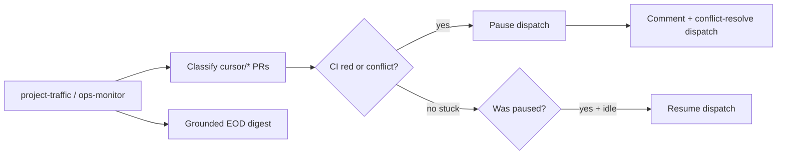

# Project traffic controller

Bounded project-management agent for the engineering PR queue: **pause** new PR
generation when monitored branches are stuck, **request fixes** (CI / merge
conflicts), **auto-resume** when clear, and emit a **grounded end-of-day digest**.

This is **not** general merge authority and **not** a full Phase B/C gate agent.
Merge stays human or scoped auto-merge ([`ci-fix-automation.md`](ci-fix-automation.md)).

## Why

Human triage of red / conflicted `cursor/*` PRs lags; meanwhile hourly
`engineering-queue` keeps opening more drafts and conflicts compound. A traffic
controller that can pause dispatch and send work back for fixes is the efficient
slice of a PM agent.

## Authority (v1)

| Action | Allowed? |
|--------|----------|
| Pause `engineering-agent` dispatch + parked-hunter-compile | Yes |
| Comment on stuck PRs requesting CI fix / conflict resolve | Yes |
| Dispatch scoped `engineering-conflict-resolve.yml` for `cursor/eng-*` | Yes |
| Rely on existing `ci-pr-autofix` / hunter-fix on CI failure | Yes (event-driven) |
| Remediate queue merge-sync lag (`pr_open` after GitHub merge) via recover/mark-merged | Yes |
| Independent verify + scoped auto-merge for **ingest_narrow** / **scoring_narrow** | Yes (deterministic path/CI/tests gate; policy `ingest_narrow` / `scoring_narrow`) |
| Receive ops-monitor email findings + planned rectification (L397 handoff) | Yes |
| Auto-remediate non–v1 ops email findings | **No** — record on handoff artifact / digest for human or eng draft |
| Broad merge PRs outside scoped classes | **No** — keep restricted; loosen only with independent verification |
| Broad Phase B/C self-healing / task invention | **No** — still deferred as L388 EOD gate agent |

## Flow



## Commands

```bash
# Status of traffic pause flag on engineering_tasks.json
ftse-project-traffic status --json

# Classify open PRs, pause/resume, comment, write digest
ftse-project-traffic run --open-prs-json /tmp/open_prs.json --json

# Dry-run (no writes / comments)
ftse-project-traffic run --dry-run --open-prs-json /tmp/open_prs.json

# Digest only from committed artifacts
ftse-project-traffic digest --write
```

## Artifacts

| Path | Purpose |
|------|---------|
| `docs/data/engineering_tasks.json` → `traffic_control` | Pause flag, stuck counts, fix-request history |
| `docs/data/project_traffic_digest.json` | Structured EOD digest |
| `docs/data/project_traffic_digest.md` | Human-readable digest |
| `docs/data/project_traffic_ops_email_handoff.json` | Latest ops-monitor email package (findings + planned rectification + email body) |
| `docs/data/queue_health.json` → `traffic_control` | Dashboard slice |

## Policy

`docs/data/library/policy.json` → `engineering.traffic_control` (defaults in
`agent_model_policy.default_policy()`):

| Key | Default | Meaning |
|-----|---------|---------|
| `enabled` | true | Master switch |
| `stuck_pr_threshold` | 2 | Pause when ≥ N stuck monitored PRs |
| `min_fail_age_minutes` | 20 | Ignore freshly failed checks (autofix race) |
| `resume_idle_minutes` | 15 | After clear, wait before resume |
| `max_fix_requests_per_pr` | 2 | Cap comments per PR (SHA-aware) |
| `comment_cooldown_hours` | 6 | Min gap between comments on same head |
| `digest_enabled` | true | Write EOD digest |

## Schedule

| Trigger | When |
|---------|------|
| **cron-job.org (primary)** | Weekdays **12:30** and **17:30 UTC** → `project-traffic.yml` |
| GitHub `schedule` | Same times (backup) |
| Ops monitor | Also runs traffic on morning / 13:15 catch-up |
| Manual | Actions → **FTSE Project Traffic** |

Register after merge:

```bash
# Example cron-job.org import (adjust secrets)
WORKFLOW=project-traffic.yml WORKFLOW_DISPATCH_PAT=… ./scripts/dispatch_github_workflow.sh
```

See [`orchestrator-cron.md`](orchestrator-cron.md).

## End-of-day digest

The digest cites committed artifacts (`project_progress.json`, `progress_report.json`,
`queue_health.json`, `ops_status.json`) and lists **checkpoint probes** with
grounded / ungrounded flags. It does **not** invent north-star claims without a
source row. Trajectory labels: `on_track` | `blocked_by_pr_queue` | `watch_stalls` |
`needs_evidence`.


## Narrow independent verify (ingest / scoring)

Policy knobs `engineering.auto_merge.ingest_narrow` and `scoring_narrow`
(`off` | `observe` | `merge`, default `merge`) enable a **deterministic**
independent gate for #651/#653-class engineering PRs:

1. Task area is `ingest` or `scoring` (and not a parked hunter)
2. Actual changed files ≤ 8, all under CI-fix safe prefixes, within the task
   allowlist, and include at least one `tests/` path
3. CI green, including the `eng-narrow-gate` job
4. When policy is `merge`, `engineering-auto-merge` may squash-merge and stamp
   `merge_class=ingest_narrow` or `scoring_narrow` on the task for EOD monitoring

### Upstream drafting (first-principle builds)

Compile / so-what / compile-cap-drain **split compound suggestions** into
first-principle sibling tasks with tightened concrete `allowed_paths` (topic
maps for FCF, healthcare, filings, …) so each build stays within the path cap
when possible — rather than one wide area allowlist that embeds multiple
objectives in a single PR.

### Cohesion bypass

When a **single** coding objective cannot fit ≤8 paths without harming the
fix (no topic map, or topic paths exceed the cap), drafting stamps
`evidence.narrow_cohesion_bypass=true`. Then:

- `eng-narrow-gate` **skips** (CI stays green)
- scoped auto-merge stays **off** — human merge only
- the task keeps the wider allowlist needed for the objective

This is independent of the authoring agent (path/CI/tests only — not a standing
LLM listener). Broader eng areas (`ops`, `prompt`, `coverage`, …) remain
human-merge for now.

The EOD digest / ops-monitor email / queue-health dashboard also list **merges
today** (with `merge_class` and independently-verified flag) so scoped
auto-merges can be monitored.

## Merge authority (future)

Loosening merge beyond scoped auto-merge should require **independent verification**
(path guard + green CI + allowlist / hunter gate), not the same agent that authored
the diff. Track as a deferred idea until traffic pause/resume has proven stable.


## Queue merge-sync remediation

When ops monitor sees engineering tasks still `open` / `pr_open` after their GitHub
PR has merged (common briefly after human merge, or if the post-merge queue commit
races), it **hands the finding to project-traffic**. Traffic runs
`recover_engineering_queue` / mark-merged reconciliation.

- If the lag clears → finding is marked fixed; ops monitor does **not** send a warn email for it.
- If the lag remains → ops monitor keeps a warn finding and emails (existing only-if-not-ok path).

This is deterministic queue bookkeeping, not merge authority and not a standing
GitHub→agent listener.

## Ops-monitor email handoff (L397)

When ops monitor is about to send a warn/fail alert email (after heal + deferral
gates), it also calls `handoff_ops_monitor_email_to_pm`:

1. Packages each unfixed finding with a deterministic `planned_rectification`
2. Includes the email subject + text/html body on the handoff artifact
3. Auto-remediates only queue merge-sync (existing PM v1 authority)
4. Leaves other items open on the handoff artifact and EOD digest section
5. Still sends SMTP (handoff failure must not block email)

Planned actions include `remediate_queue_merge_sync`, `request_unstick_stuck_prs`,
`rerun_or_dispatch_workflow`, `draft_ops_engineering_task`, and `human_triage`.

## Related

- [`ci-fix-automation.md`](ci-fix-automation.md) — PR autofix + scoped auto-merge
- [`engineering-sync.md`](engineering-sync.md) — queue recovery / clash dispatch
- [`ops-monitor.md`](ops-monitor.md) — daily health (invokes traffic)
- [`progress-report.md`](progress-report.md) — north-star rollup used by digest
